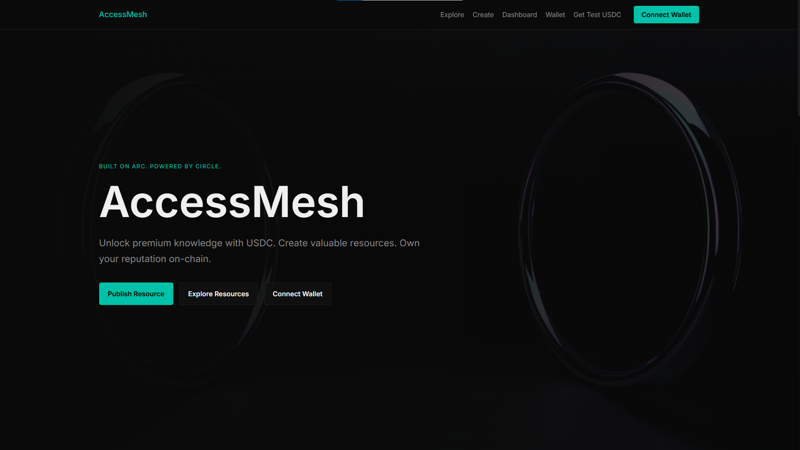
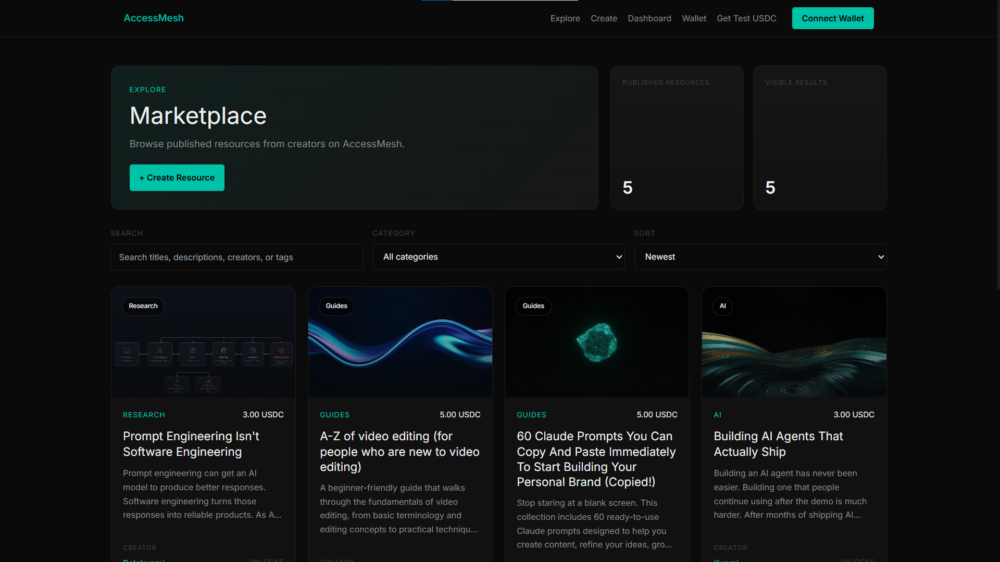
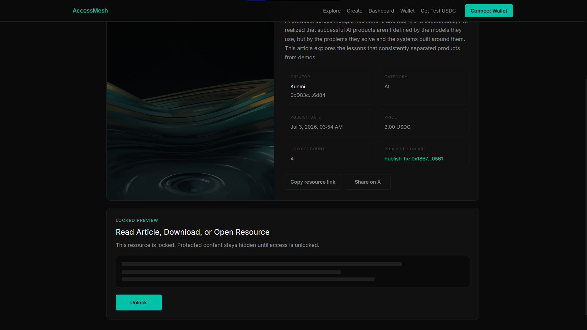
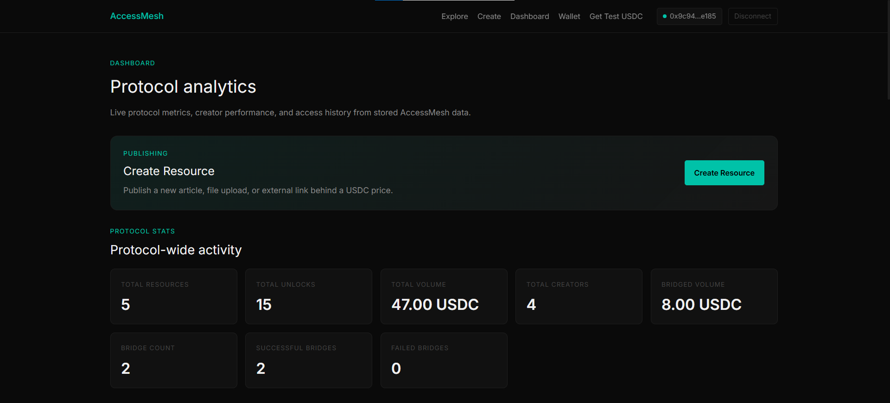
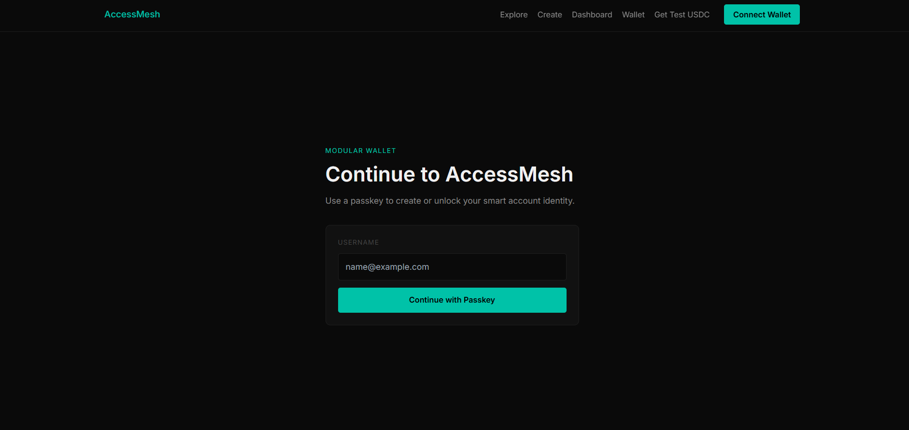
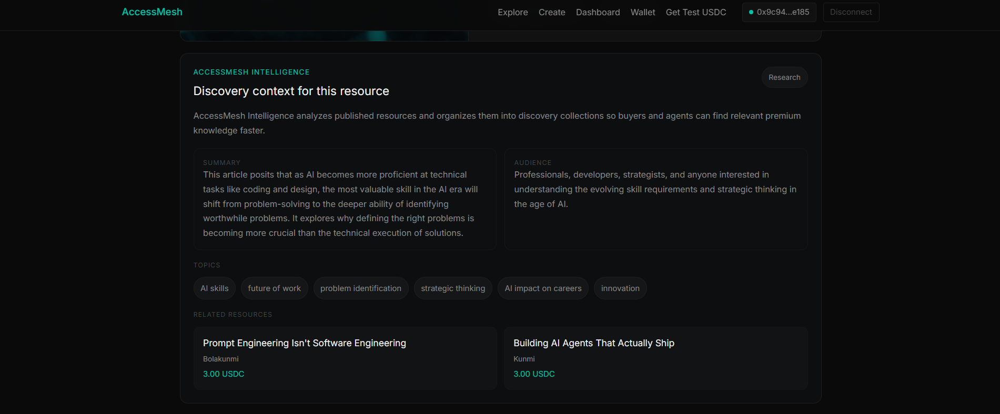

<div align="center">

# AccessMesh

### A programmable payment layer for premium digital knowledge.

<p>
Creators deserve to be paid for the value they produce, not the size of their audience. Developers deserve a simple way to monetize existing applications without rebuilding them. AccessMesh brings both together through programmable USDC payments, allowing premium knowledge to be published, purchased, and verified across the web.
</p>

<br>

[](#)
[](#)
[](#)
[](#)
[](#)
[](#)

</div>

---

## Live Demo

**Marketplace**

https://accessmesh.vercel.app/

**Middleware Demo**

https://accessmesh.onrender.com/

**Official X**

https://x.com/AccessMesh

---

> 

---

# Overview

AccessMesh is a premium knowledge marketplace and programmable payment infrastructure built on **Arc** using **Circle's** wallet and payment stack.

The project was created to solve a problem that has existed long before blockchain: valuable digital knowledge is difficult to monetize fairly.

Today, creators often rely on subscriptions, advertising, sponsorships, or donations. These models either force users to commit before they've received value or reward creators based on attention instead of the quality of the knowledge they publish.

AccessMesh introduces a different approach.

Instead of charging users for an entire platform, creators sell access to individual resources. A technical article, research report, AI prompt library, dataset, API, or documentation page can all be purchased independently using USDC. Buyers only pay for what they actually need, while creators earn revenue every time their work provides value.

The marketplace is only one part of the project.

AccessMesh also provides a middleware layer that allows developers to integrate the same payment verification into existing applications. Instead of migrating content into a new platform, developers can continue hosting their resources wherever they choose while AccessMesh handles ownership verification and payment gating.

This separation between **where content lives** and **how access is verified** is what transforms AccessMesh from a marketplace into infrastructure.

---

# Why We Built AccessMesh

The internet has dramatically reduced the cost of publishing information, but it hasn't solved how knowledge should be valued.

Most monetization models available today were designed for human readers rather than programmable software.

Subscription platforms encourage creators to continuously produce content simply to justify recurring payments, even when users may only need a single article or report.

Advertising rewards engagement rather than expertise.

Sponsorships introduce commercial influence into educational content.

At the same time, software is becoming an active participant in the internet.

AI agents now search documentation, compare sources, retrieve research, generate reports, and execute workflows on behalf of users. As these systems become more capable, they also need a standardized way to purchase premium information programmatically.

AccessMesh addresses both challenges by treating knowledge as an individual digital asset rather than a feature locked behind a subscription.

Every resource has its own identity, owner, price, purchase history, and access verification.

Whether the buyer is a person reading an article or an autonomous agent retrieving context for a task, the interaction follows the same programmable payment flow.

---

# What AccessMesh Does

AccessMesh consists of two complementary products.

## 1. AccessMesh Marketplace

The marketplace allows creators to publish free or premium digital resources without managing payment infrastructure themselves.

Creators can:

- Publish articles and educational resources
- Set prices in USDC
- Manage their published resources
- Receive payments after successful purchases
- Build public creator profiles
- Distribute knowledge without relying on subscriptions

Users can:

- Discover premium resources
- Unlock only the content they need
- Build a permanent ownership library
- Pay with USDC on Arc
- Fund their Arc wallet through Circle CCTP when needed

Rather than charging users for unlimited access to a platform, AccessMesh encourages direct value exchange between creators and buyers.

---

## 2. AccessMesh Middleware

Many developers already own websites, APIs, documentation portals, AI services, research platforms, and internal knowledge bases.

Moving all of that content into another marketplace is neither practical nor desirable.

AccessMesh Middleware was built to solve that problem.

Instead of moving content, developers add a lightweight verification layer to existing routes.

Whenever a protected endpoint receives a request, the middleware checks whether the requesting wallet has already purchased access to the associated resource on AccessMesh.

If ownership is verified, the request continues normally.

If ownership cannot be verified, the middleware responds with a standard **HTTP 402 Payment Required** response containing the information required to complete the purchase before retrying the request.

Because the middleware uses the same verification system as the marketplace, developers gain programmable payment infrastructure without rebuilding their products.

For integration instructions, see **[docs/middleware.md](docs/middleware.md)**.

---

> 

---

> 

---

> 

---

# How AccessMesh Works

AccessMesh is designed around a straightforward payment and verification model.

Creators publish resources, define their own pricing, and make them available through the marketplace. Users can browse resources without restriction, but premium content remains protected until ownership has been verified.

Unlike subscription platforms, every purchase is tied to a single resource. Once that resource has been unlocked, the buyer retains permanent access without paying again.

The unlock process is intentionally simple:

1. A creator publishes a premium resource and chooses its price.
2. A buyer opens the resource page and selects **Unlock**.
3. If the buyer already holds enough Arc USDC, the payment is executed immediately.
4. If the buyer's Arc wallet does not contain enough USDC, AccessMesh can fund the wallet through Circle CCTP (currently from Base Sepolia to Arc Testnet).
5. After the payment is confirmed on-chain, ownership is recorded.
6. Every future request to that resource is verified automatically before premium content is displayed.

This payment model creates a direct relationship between creators and buyers without requiring subscriptions, recurring billing, or centralized payment providers.

---

# Authentication Without Seed Phrases

One of the biggest barriers to Web3 adoption is wallet onboarding.

Traditional wallets require users to manage seed phrases before they can interact with an application. While experienced users are comfortable with this process, it creates unnecessary friction for everyone else.

AccessMesh uses **Circle Programmable Wallets** together with **WebAuthn passkeys** to provide a simpler onboarding experience.

When a new user signs up, a programmable wallet is created behind the scenes and secured using modern passkey authentication. Instead of writing down a recovery phrase or installing a browser extension before getting started, users can authenticate using the same biometric or device-based methods they already use every day.

This approach significantly reduces onboarding friction while still allowing every payment and ownership record to be settled on-chain.

The goal is to make blockchain infrastructure feel invisible without sacrificing the benefits it provides.

---

> 

---

# Payments on Arc

Every premium resource purchased through AccessMesh is settled using **USDC on Arc**.

Arc was chosen because of its fast settlement times and low transaction costs, making it practical for applications where users may purchase individual resources rather than large subscription plans.

From the user's perspective, purchasing a resource should feel no different from buying an article, report, or API key on any modern web application.

Behind the scenes, AccessMesh handles payment execution, confirmation, and ownership verification before granting access to premium content.

This allows creators to receive blockchain-backed payments without exposing buyers to unnecessary complexity.

---

# Cross-Chain Funding with Circle CCTP

A common challenge for blockchain applications is that users often hold funds on one network while the application operates on another.

AccessMesh addresses this by integrating **Circle Cross-Chain Transfer Protocol (CCTP)**.

If a buyer attempts to unlock a resource but does not have enough Arc USDC available, AccessMesh can automatically guide them through funding their Arc wallet using USDC from a supported source chain.

At the moment, Base Sepolia is supported as the funding source. Once the transfer is completed through CCTP, the user receives native Arc USDC and can immediately continue the unlock flow without manually using third-party bridges.

This significantly reduces the friction involved in acquiring the correct assets before interacting with the marketplace.

As additional CCTP routes become available, AccessMesh can expand support to more networks without changing the overall user experience.

---

# Access Verification

Ownership is verified every time premium content is requested.

For resources published directly on AccessMesh, verification happens automatically before protected content is rendered.

For external applications using AccessMesh Middleware, the same verification logic is exposed through a dedicated verification endpoint.

This means the marketplace and middleware share the same source of truth.

A purchase made through AccessMesh immediately becomes valid for any application protecting that resource with AccessMesh Middleware.

Developers do not need to build their own entitlement systems, manage payment state, or synchronize ownership across multiple services.

AccessMesh becomes the verification layer while applications remain responsible only for serving their own content.

---

## AccessMesh Intelligence

AccessMesh Intelligence is the AI discovery layer inside AccessMesh.

Instead of leaving published resources as a flat marketplace feed, AccessMesh Intelligence analyzes resources after publication and organizes them into useful discovery contexts. It generates resource summaries, identifies topics, estimates the intended audience, assigns placement labels, maps related resources, and groups premium knowledge into discovery collections.

This gives the marketplace a more active discovery layer. A resource is not only published and listed; it can be understood, categorized, connected to similar resources, and surfaced where it is most relevant.

> 

### What it does

- Analyzes newly published resources using Gemini.
- Generates concise resource summaries.
- Identifies topics, audience, and category context.
- Groups resources into discovery collections.
- Maps related resources where relevant.
- Adds AI-generated metadata to resource pages.
- Enriches middleware payment responses with machine-readable resource context.

### Why it matters

AccessMesh Intelligence helps users and external clients discover premium knowledge faster. It also makes AccessMesh more useful for agentic workflows because protected resources can expose structured metadata before access is granted, allowing automated clients to understand what a resource is about before deciding whether it is relevant to their task.

The intelligence layer is non-blocking. Publishing does not depend on Gemini succeeding, and AI failures do not prevent creators from publishing resources.

---

# AccessMesh Middleware

The marketplace solves monetization for creators who want to publish directly on AccessMesh.

The middleware solves monetization for everyone else.

Many organizations already have valuable digital assets hosted on their own infrastructure:

- Technical documentation
- Premium APIs
- Research portals
- AI endpoints
- Internal knowledge bases
- Download portals
- Educational platforms
- Private datasets

Migrating those systems to another marketplace would introduce unnecessary operational complexity.

Instead, AccessMesh Middleware allows developers to keep their existing applications exactly where they are.

A developer simply protects one or more routes using the middleware.

Whenever a request reaches a protected endpoint, the middleware verifies whether the requesting wallet owns access to the associated resource.

If ownership is confirmed, the request proceeds exactly as it would without the middleware.

If ownership cannot be confirmed, the middleware returns a machine-readable **HTTP 402 Payment Required** response containing the resource information required to complete the purchase through AccessMesh.

This design makes the middleware compatible with both traditional applications and autonomous software.

A browser can redirect the user to the purchase page.

An AI agent can interpret the 402 response, complete the payment programmatically, and retry the request.

Because AccessMesh follows standard HTTP semantics instead of proprietary protocols, developers can integrate it into existing Express applications with minimal changes.

---

# Why HTTP 402 Matters

The HTTP `402 Payment Required` status code has existed for decades but has rarely been adopted in production because the web lacked a practical payment layer.

Programmable stablecoin payments change that.

Instead of inventing a proprietary response format, AccessMesh embraces an existing web standard.

When access cannot be granted, the middleware responds with structured payment information that applications, users, or AI agents can understand.

This makes premium digital content easier to integrate into automated workflows while remaining familiar to developers building traditional web applications.

Rather than treating payment as something separate from the request lifecycle, AccessMesh makes it part of the protocol itself.

---

# Technical Architecture

AccessMesh is designed as a modular application where payment execution, access verification, content management, and developer integrations remain independent while sharing the same source of truth.

At a high level, the platform consists of four primary layers:

1. **Marketplace** – The user-facing application where creators publish resources and users discover, purchase, and manage premium content.

2. **Payment Layer** – Handles wallet creation, transaction execution, payment confirmation, and cross-chain funding.

3. **Verification Layer** – Determines whether a wallet owns access to a specific resource before protected content is returned.

4. **Middleware Layer** – Allows external applications to use the same verification system without moving their content onto the AccessMesh marketplace.

This separation allows each component to evolve independently while maintaining a consistent payment and ownership model across the ecosystem.

---

# System Flow

The following illustrates a typical purchase flow.

```text
Creator
   │
Publishes Resource
   │
   ▼
AccessMesh Marketplace
   │
Buyer Opens Resource
   │
   ▼
Ownership Check
   │
 ┌───────────────┐
 │               │
 ▼               ▼
Already Owns   Doesn't Own
 │               │
 ▼               ▼
Show Content  Execute Payment
                   │
                   ▼
         Payment Confirmation
                   │
                   ▼
        Ownership Recorded
                   │
                   ▼
         Premium Content Returned
```

The same ownership record is reused by AccessMesh Middleware when protecting external applications.

---

# Repository Structure

```text
.
├── app/                         # Next.js App Router pages and API routes
├── components/                  # Reusable UI components
├── lib/                         # Blockchain, wallet and payment utilities
├── prisma/                      # Database schema and migrations
├── public/                      # Static assets
├── services/                    # Business logic and verification services
├── docs/
│   └── middleware.md            # Middleware integration guide
├── examples/
│   └── accessmesh-middleware/   # Middleware example project
└── README.md
```

The repository intentionally keeps the middleware example separate from the marketplace so developers can understand the integration without navigating the entire application.

---

# Technology Stack

AccessMesh was built using technologies selected for reliability, developer experience, and long-term maintainability rather than simply following current trends.

| Layer | Technology | Purpose |
|--------|------------|---------|
| Frontend | Next.js | Full-stack React framework powering the marketplace and API routes |
| Language | TypeScript | End-to-end type safety across the application |
| Styling | Tailwind CSS | Utility-first styling system for a consistent interface |
| Database | PostgreSQL | Persistent storage for resources, users, purchases, and creator data |
| ORM | Prisma | Type-safe database access and schema management |
| AI | Gemini 2.5 Flash | Powers AccessMesh Intelligence for resource analysis, discovery collections, related-resource mapping, and machine-readable metadata generation |
| Authentication | WebAuthn Passkeys | Passwordless authentication |
| Wallet Infrastructure | Circle Programmable Wallets | Wallet creation and transaction signing |
| Stablecoin | USDC | Native payment currency |
| Blockchain | Arc Testnet | Payment settlement |
| Cross-chain | Circle CCTP | Funding Arc wallets from supported source chains |
| Middleware | Express.js | Route protection for external applications |
| Deployment | Vercel | Marketplace deployment |
| Middleware Hosting | Render | Middleware demonstration service |

---

# Why These Technologies?

## Next.js

AccessMesh uses Next.js because it provides a mature full-stack environment capable of handling both the user interface and backend API routes within a single project. This simplifies deployment while keeping frontend and backend development closely aligned.

---

## TypeScript

Payment infrastructure benefits significantly from strong typing. TypeScript reduces runtime errors, improves maintainability, and provides a better development experience as the project grows.

---

## Prisma and PostgreSQL

Ownership records, creator profiles, purchases, resources, and verification data require reliable persistence.

Prisma provides a type-safe interface over PostgreSQL, making database interactions predictable while allowing the schema to evolve alongside the application.

---

### Gemini 2.5 Flash (AccessMesh Intelligence)

AccessMesh Intelligence adds an AI-powered discovery layer to the marketplace without becoming part of the payment path. After a resource is successfully published, Gemini analyzes its content to generate structured metadata, including summaries, topics, intended audience, related resources, marketplace placement, and discovery collections.

This metadata enriches the marketplace experience for users while also extending the middleware with machine-readable context that external applications and AI agents can consume before requesting paid access. Because analysis runs asynchronously, creators never have to wait for AI processing before their content becomes available.

---

## Circle Programmable Wallets

Wallet creation is one of the largest sources of friction in Web3 applications.

Circle Programmable Wallets allow AccessMesh to provision wallets without exposing users to unnecessary complexity while still enabling fully on-chain payments.

This creates an onboarding experience that feels closer to a modern SaaS application than a traditional crypto product.

---

## Circle CCTP

Cross-chain liquidity is an important usability problem.

Many users already hold USDC on other supported networks. CCTP allows AccessMesh to move value onto Arc without relying on third-party bridges or wrapped assets.

As additional supported routes become available, the same user experience can extend to more ecosystems.

---

## Arc

AccessMesh was designed around fast, low-cost stablecoin payments.

Arc provides the settlement environment needed to make individual resource purchases practical without introducing the cost or latency associated with larger blockchain transactions.

---

# Developer Experience

Although AccessMesh provides its own marketplace, the long-term vision extends beyond hosting content.

Developers should be able to integrate programmable payment verification into applications they already own.

The middleware example included in this repository demonstrates that philosophy.

Instead of rebuilding an application, developers add a verification layer in front of existing routes.

Applications continue serving their own content.

AccessMesh becomes responsible for determining whether the requesting wallet has already purchased access.

This approach minimizes integration effort while allowing developers to retain complete ownership of their products.

Detailed integration instructions are available in **[docs/middleware.md](docs/middleware.md)**.

---

# Running AccessMesh Locally

Clone the repository.

```bash
git clone https://github.com/Kunmiesther/AccessMesh.git
```

Navigate into the project.

```bash
cd AccessMesh
```

Install dependencies.

```bash
npm install
```

Configure the required environment variables.

```bash
cp .env.example .env
```

Start the development server.

```bash
npm run dev
```

The marketplace will be available locally at:

```text
http://localhost:3000
```

To experiment with the middleware example, refer to **[docs/middleware.md](docs/middleware.md)** for setup instructions and example requests.

---

# Roadmap

AccessMesh is being developed as a long-term platform rather than a single application. The current marketplace and middleware establish the foundation, but the broader goal is to make programmable payment verification available anywhere premium digital content is served.

The roadmap below reflects the direction of the project as it evolves.

## Short Term

- Support additional Circle CCTP source chains for funding Arc wallets.
- Expand markdown editing capabilities with a richer authoring experience.
- Improve resource discovery with filtering, categories, and recommendations.
- Add richer creator analytics and revenue insights.
- Improve middleware documentation and provide additional integration examples.
- Expand middleware support for more backend frameworks.

## Medium Term

- Publish the middleware as an official npm package.
- Release a JavaScript and TypeScript SDK.
- Provide middleware examples for Express, Fastify, NestJS, Hono, and serverless environments.
- Add webhook support for purchase events.
- Introduce API keys and developer dashboards.
- Support usage-based pricing for APIs in addition to one-time resource purchases.

## Long Term

The long-term vision for AccessMesh extends beyond a marketplace.

The marketplace is only one way content can be distributed.

The larger opportunity is to become the payment and verification infrastructure for premium digital knowledge across the web.

Future work includes:

- A public verification API.
- Multi-language SDKs.
- Plugins for documentation platforms and CMSs.
- Native integrations for AI applications.
- Agent-to-agent payment workflows.
- Enterprise tooling for organizations managing premium knowledge at scale.
- Additional settlement networks as the ecosystem evolves.

The objective is to make monetizing premium knowledge as straightforward as authenticating a user or storing a file.

---

# Contributing

Contributions are welcome.

Whether you're interested in improving the marketplace, extending the middleware, fixing bugs, improving documentation, or proposing new ideas, every contribution helps move the project forward.

If you'd like to contribute:

1. Fork the repository.
2. Create a feature branch.
3. Make your changes.
4. Submit a pull request with a clear description of the improvement.

For larger changes or architectural proposals, opening an issue before implementation is encouraged.

Constructive feedback from developers, creators, and users is equally valuable and helps shape the future direction of the project.

---

# Acknowledgements

AccessMesh is built using technologies and infrastructure provided by:

- Arc
- Circle
- Next.js
- React
- Prisma
- PostgreSQL
- Tailwind CSS
- TypeScript

Their tools make projects like AccessMesh possible.

---

# License

This project is released under the MIT License.

---

# Closing Thoughts

AccessMesh started with a simple question:

**Why is valuable digital knowledge still difficult to monetize fairly?**

Answering that question led to two complementary products.

The first is a marketplace where creators can publish premium resources and receive programmable USDC payments without relying on subscriptions.

The second is a middleware layer that allows developers to add the same payment verification to applications they already own, without migrating their content to another platform.

Together, these components establish a shared payment and ownership model that can be reused across websites, APIs, documentation, datasets, AI services, research portals, and other premium digital experiences.

The long-term ambition is not to become the largest content platform on the internet.

It is to become the infrastructure that enables premium knowledge to be monetized wherever it already exists.

If AccessMesh succeeds, creators won't have to choose between reach and revenue, developers won't have to reinvent payment systems for every product, and premium digital knowledge will become easier for both humans and AI agents to discover, purchase, and use.

---

<div align="center">

**Building the future of programmable knowledge payments.**

Made with Arc, Circle, and USDC.

</div>
